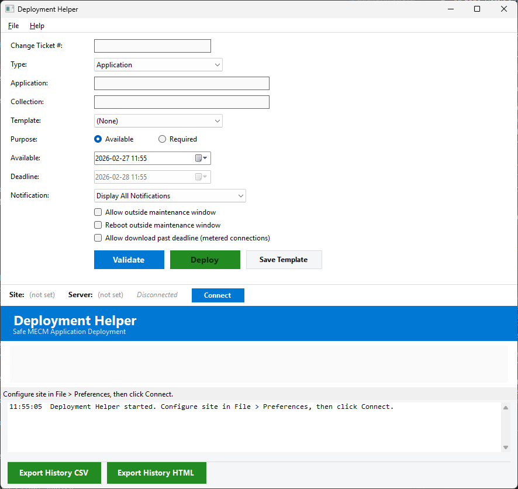

# Deployment Helper

Safe, fast MECM application and software update group deployment with pre-execution validation, safety guardrails, and immutable audit logging.



## Features

- **Single-pane deployment workflow** - Enter change ticket, application or SUG, collection, and deploy
- **Application + SUG support** - Deploy applications or software update groups from the same interface
- **5-check validation engine** - Application/SUG exists, content distributed, collection valid, collection safe (blocks built-in system collections), no duplicate deployment
- **Safety guardrails** - All `SMS000*` built-in collections blocked, deploy button disabled until validation passes, confirmation dialog before execution
- **Required SUG auto-config** - Required SUG deployments auto-set download fallback from default site boundary group DP
- **Metered connection handling** - Auto-checked for Required deployments (app and SUG)
- **Deployment templates** - Predefined and user-saved configs, Save Template button in GUI
- **Immutable audit log** - JSONL format (one JSON object per line), append-only, records every deployment attempt (success and failure)
- **Export** - CSV and HTML history reports
- **Dark mode** - Full theme support with 16 color variables

## Requirements

- PowerShell 5.1
- .NET Framework 4.8+
- Configuration Manager console installed
- CM admin permissions for application deployment

## Quick Start

1. Launch: `powershell -ExecutionPolicy Bypass -File start-deploymenthelper.ps1`
2. File > Preferences: Set Site Code and SMS Provider
3. Click **Connect** to establish CM connection
4. Enter change ticket number, application name, and collection name
5. Click **Validate** to run the 5-check validation engine
6. If all checks pass, click **Deploy**

## Preferences

| Setting | Description |
|---------|-------------|
| Dark Mode | Toggle dark/light theme (requires restart) |
| Site Code | 3-character MECM site code |
| SMS Provider | SMS Provider server hostname |
| Deployment Log Path | Custom path for JSONL audit log (default: local `Logs\` folder) |

## Project Structure

```
deploymenthelper/
    start-deploymenthelper.ps1          Main GUI application
    Module/
        DeploymentHelperCommon.psd1     Module manifest (20 functions)
        DeploymentHelperCommon.psm1     Core module
    Templates/
        WorkstationPilot.json           Deployment template
        WorkstationProduction.json
        ServerPilot.json
        ServerProduction.json
    Logs/                               Session logs + deployment log
    Reports/                            CSV/HTML exports
```

## Template Schema

Templates are JSON files in the `Templates\` folder:

```json
{
    "Name": "Workstation Pilot",
    "DeployPurpose": "Available",
    "UserNotification": "DisplayAll",
    "OverrideServiceWindow": false,
    "RebootOutsideServiceWindow": false,
    "AllowMeteredConnection": false,
    "DefaultDeadlineOffsetHours": 0
}
```

## License

[GPL-3.0](LICENSE)
